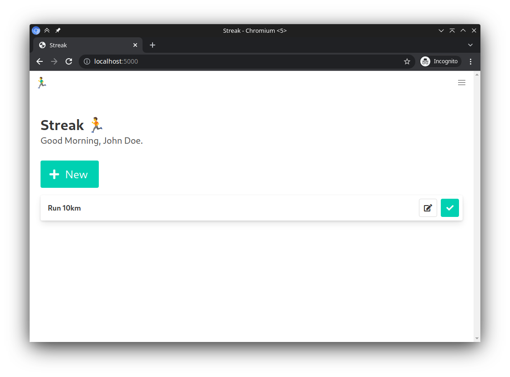
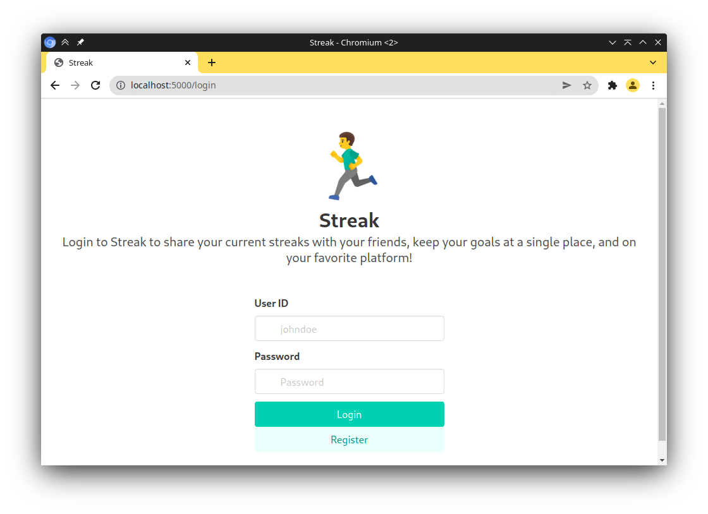

<p align="center">
    

<h2 align="center">Streak</h2>

  <p align="center">
    Schedules are never as difficult to stick with, when you are with your friends
    <br>
    <a href="https://github.com/srevinsaju/streak/issues/new">Report bug</a>
    ·
    <a href="https://github.com/srevinsaju/streak/issues/new">Request feature</a>
  </p>
</p>

<div align="center">

[](https://python.org/)<br/><br/>


</div>


https://user-images.githubusercontent.com/48695438/156912998-8d83a4d6-f595-4f52-a057-3cca8b2d9734.mp4


An app to help you focus on your goals,
share your streaks with friends on your 
preferred platform. 

The project helps people schedule and plan their work. It notifies about the task and motivates them to complete it with
a streak system. New achievements on your streaks can also be followed by your friends, and you can 
appreciate your friends on their streak milestones too, changing the ever mundane boring tasks into 
a fun and productive social tool. Streak's event system helps you to connect your task notifications 
on to Discord, or Telegram, making it super easy to keep all your daily tasks at one place! 🥳






This project was developed as part of [HackHub 2022](https://hackhub.ieeecsvitc.com/).


## Setup 
Create a `.env` file. Copy the sample `.env.sample` as `.env`
and add the appropriate values there.

```bash
docker build . -t streak:latest
```

## Run 
```bash 
python -m streak
```
or
```bash
docker run -p 5000:5000 streak:latest
```

## License 
This project is licensed under the MIT license. See [LICENSE](./LICENSE) for more information. 


